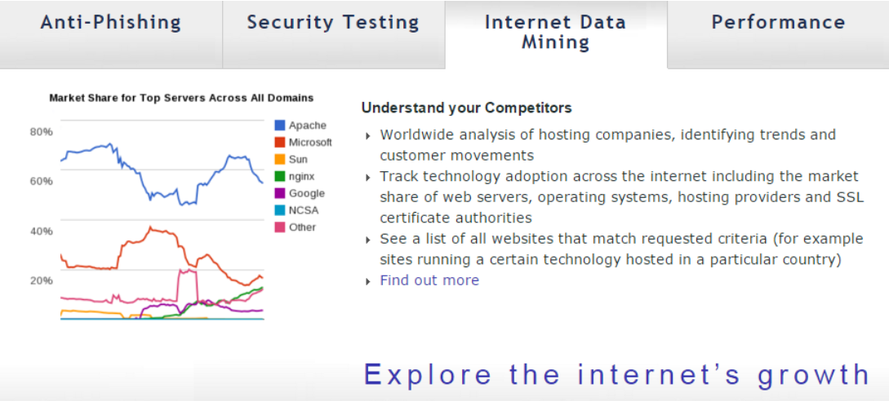
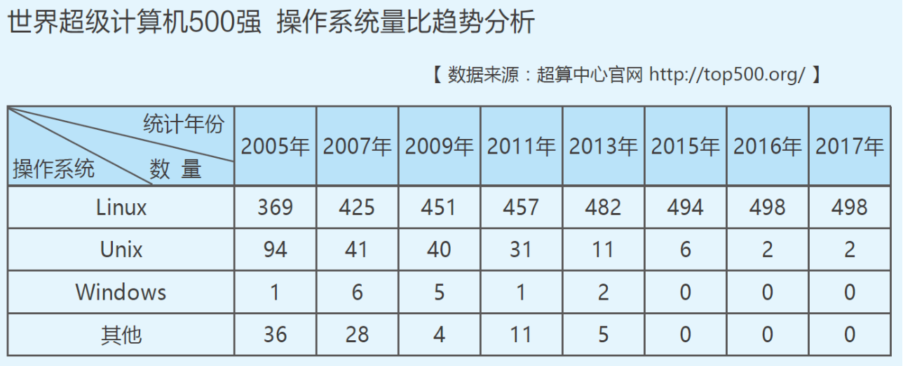
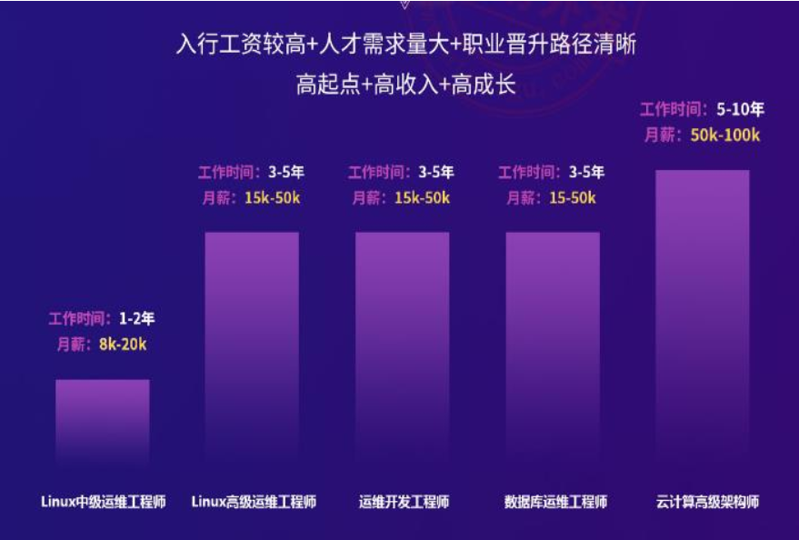

# 一、行业介绍

## 1.1、主流IT行业介绍
### 1.1.1、产品设计的重要性
- 重要的产品经理
- 苦逼的产品经理

### 1.1.2、岗位区分
- 产品经理
- 设计类方向（UI、UE）
- 开发方向（PHP、Python、Java、C）
- 运维方向（Linux、云计算）
- 网络方向（思科、华为、华三）

### 1.1.3、运维方向优点
- 行业需求量逐年增加
- 行业薪资逐渐高于行业平均薪资
- 技术淘汰速度非常慢
- 从业压力较小，是所有技术类行业中最小的

## 1.2、行业中Linux占比
### 1.2.1、Linux介绍
- 开源与免费的操作系统
- 更加安全
- 更加稳定
- 适合服务器使用

### 1.2.2、Linux 行业占比
#### 服务器趋势

#### 操作系统对比

## 1.3、人才需求与就业情况
### 1.3.1、 百度百聘
- Java：22038
- 运维工程师：6161
- Web前端：5264
- PHP：5159
- Python：2025

### 1.3.2、就业情况
- 云计算学科平均薪资7300以上
- 云计算学科学员就业率100%全员就业
- 云计算学科毕业4周就业率95%以上

## 1.4、运维职业发展路径

- Linux中级运维工程师
- Linux高级运维工程师
- 运维开发工程师
- 数据库运维工程师
- 云计算高级工程师

## 资料来源
[尚硅谷官网](http://www.atguigu.com/)