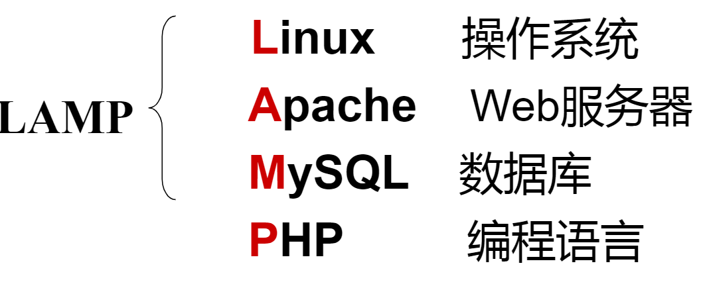

# 二、Linux简介

## 2.1、UNIX与Linux发展史
### 2.1.1、UNIX发展历史
1. 1965年，美国麻省理工学院（MIT）、通用电气公司（GE）及AT&T的贝尔实验室联合开发`Multics`工程计划.其目标是开发一种交互式的具有多道程序处理能力的分时操作系统，但因Multics追求的目标过于庞大复杂，项目进度远远落后于计划，最后贝尔实验室宣布退出。
2. 1969年，美国贝尔实验室的肯• 汤普森在DEC PDP-7机器上开发出了`UNIX`系统。
3. 1971年，肯• 汤普森的同事丹尼斯• 里奇发明了`C语言`；1973年，UNIX系统的绝大部分源代码用C语言重写，这为提高UNIX系统的可移植性打下基础。

### 2.1.2、UNIX主要发行版本
| 操作系统       | 公司          | 硬件平台  |
|:-------------: |:-------------:| :-----|
| AIX           | IBM           | PowerPC |
| UX            | HP            | PA-RISC |
| Solaris       | SUN           | SPARC   |
| Linux、BSD    | Red Hat、Ubuntu、FreeBSD| IA(Intel, AMD, Cyrix,RISE..)  |

### 2.1.3、Linux发展历史
1. Linux系统诞生于1991年，由芬兰大学生李纳斯（Linus Torvalds）和后来陆续加入的众多爱好者共同开发完成。
2. Linux是自由软件，源代码开放的UNIX。

### 2.1.4、Linux分类
1. 内核版(www.kernel.org)

| 内核       | 版本      |    
|:-------------: |:-------------:|
| RHEL6.x        | 2.6.x        |
| RHHL7.x        | 3.10.x       | 
     
2. 发行版

| 系列       | 版本       |   
|:-------------: |:-------------|
| RedHat        | 个人版:Fedora, 企业版: RHEL(RedHat Enterprise Linux) |
| Debian系列    |  ...      | 

### 2.1.5、主要发行版本

## 2.2、开源软件简介

- Apache
- Nginx
- MySQL
- PHP
- Samba: Linux和Windows之间的内网文件服务器
- MongoDB
- Redis
- Python
- Ruby
- Sphinx: 中文分词

### 2.2.1、开源软件
- 使用的自由 (绝大多数开源软件免费)
- 研究的自由 (可以获得软件源代码)
- 散步及改良的自由 (可以自由传播、改良甚至销售)

### 2.2.2、开源技术(GPL)

## 2.3、Linux应用领域
### 2.3.1、服务器行业
1. www.netcraft.com

### 2.3.2、电影娱乐行业

### 2.3.3、嵌入式领域
1. 手机、平板电脑
2. 智能家电：机顶盒、游戏机、数码相机等
3. 智能卡系统
4. 航空系统
5. 银行系统
6. 卡拉OK点歌系统

## 资料来源
[尚硅谷官网](http://www.atguigu.com/)