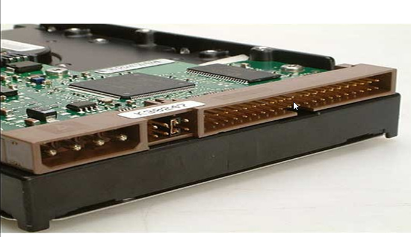
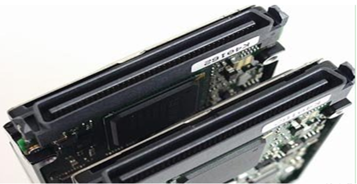
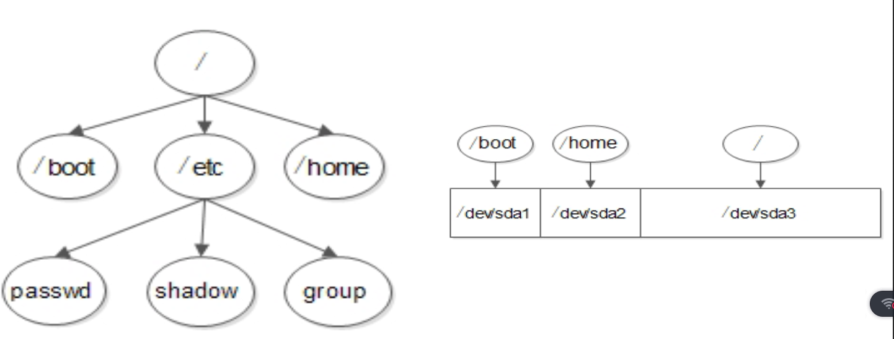
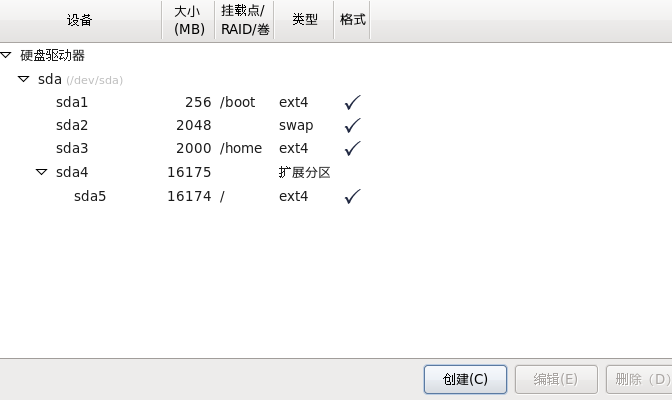
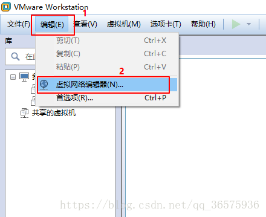
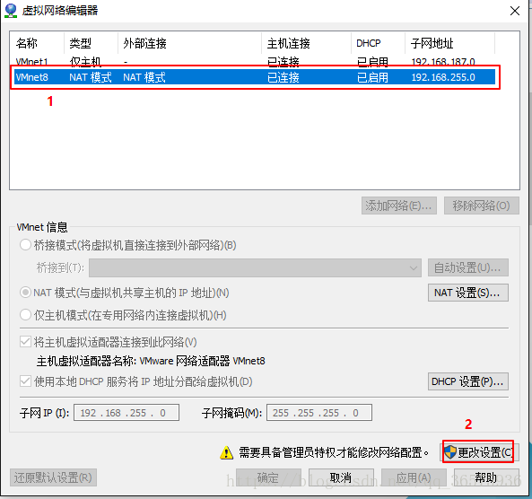
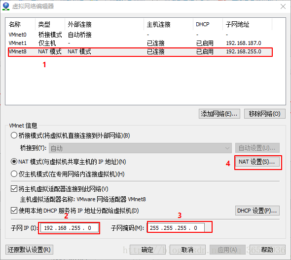
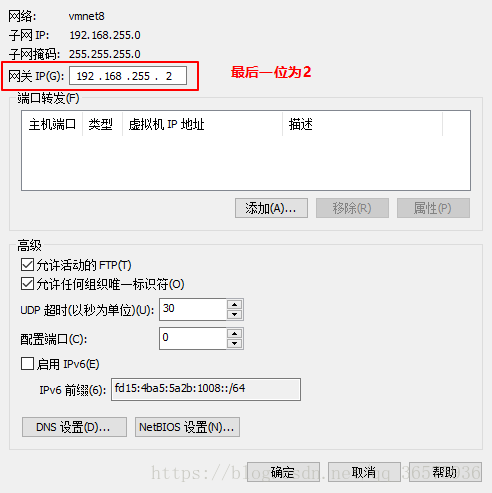

# 三、Linux安装

## 3.1、VMware虚拟机安装与使用
### 3.1.1、介绍
`VMware`是一个虚拟PC的软件，可以在现有的操作系统上虚拟出一个新的硬件环境，相当于模拟出一台新的PC ，以此来实现在一台机器上真正同时运行两个独立的操作系统。

[VMware官方网站](http://www.vmware.com)

### 3.1.2、特点
1. 不需要分区或重新开机就能在同一台PC上使用两种以上的操作系统
2. 本机系统可以与虚拟机系统网络通信
3. 可以设定并且随时修改虚拟机操作系统的硬件环境

### 3.1.3、建议配置
1. CPU：建议主频为1GHz以上
2. 内存：建议1GB以上
3. 硬盘：建议分区空闲空间8GB以上

### 3.1.4、安装

### 3.1.5、新建虚拟机

- 虚拟机网络设置

| 连接方式        | 连接网卡     | 是否能连接本机  | 是否能连接局域网 |  是否能连接公网 |
| :-------------: |:-------------:| :-----:| :-----:| :-----:|
| 桥接      | 本地真实网卡 | 是 |  是 |  是 |
| NAT      | VMNet8      |   是 | 否 | 是 |
| 仅主机 | VMNet1     |    是 | 否 | 否 |


::: tip
1、 建议创建好虚拟机之后，进行快照<br/>
2、如果设置为去桥接模式，将连接方式改为固定的本机网卡
:::

## 3.2、系统分区
### 3.2.1、磁盘分区
1. 概念
    使用分区编辑器（partition editor）在磁盘上划分几个逻辑部分。
    碟片一旦划分成数个分区（Partition），不同类的目录与文件可以存储进不同的分区。
2. 目的
    方便读取数据和存储数据

### 3.2.2、分区表
- MBR分区表（主引导记录分区表）
最大支持2.1TB硬盘，最多支持4个分区（一个硬盘）

- GPT分区表 （全局唯一标示分区表）
GPT支持9.4ZB硬盘（1ZB=1024PB，1PB=1024EB，1EB=1024TB）。理论上支持的分区数没有限制，但windows限制128个主分区


- 分区类型（针对MBR）
    - 主分区: 最多只能有4个
    - 扩展分区:
        - 一块硬盘最多只能有1个
        - 主分区加扩展分区最多有4个
        - 不能写入数据，只能包括逻辑分区
    - 逻辑分区
        - 总是从硬盘设备文件名序号5开始的(sda5)
    

### 3.2.3、格式化 （逻辑格式化）
1. 概念
    它是指根据用户选定的文件系统（如FAT16、FAT32、NTFS、EXT2、EXT3、EXT4、XFS等），
    在磁盘的特定区域写入特定数据，在分区中划出一片用于存放文件分配表、目录表等用于文件管理的磁盘空间。
2. 目的
    `写入文件系统`，附带将分区清空


::: tip
1、 INode 也是存在存储上线的，不能无限写入空文件
:::

### 3.2.4、硬件设备文件名
1. 设备文件名

| 硬件  |  设备文件名 |
|:--:|--:|
|IDE硬盘            | /dev/hd[a-d]         |
|SCSI/SATA/USB硬盘  | /dev/sd[a-p]          |
|光驱               | /dev/cdrom或/dev/sr0  |
|软盘               | /dev/fd[0-1]        |
|打印机(25针)       | /dev/lp[0-2]    |
|打印机(USB)        | /dev/usb/lp[0-15]   |
|鼠标               | /dev/mouse

2. IDE 硬盘 

3. SCSI 硬盘

4. SATA 硬盘


### 3.2.5、挂载点
- 必须分区
    - / （根分区）
    - swap分区 （交换分区）
        - 如果真实内存小于4GB，swap位内存的两倍
        - 如果真实内存大于4GB，swap和内存一致
        - 实验环境，不大于2GB

- 推荐分区 (如果不分配的话，硬盘慢了，系统会启动不了)
    - /boot (启动分区)

- 常用分区
    - /home (用于文件服务器) 
    - /www (用于Web服务器)

### 3.2.6、文件系统结构
 

### 3.2.7、总结
- 分区：把大硬盘分为小的逻辑分区
- 格式化：写入文件系统
- 分区设备文件名：给每个分区定义设备文件名
- 挂载：给每个分区分配挂载点（设备文件名和空目录进行关联）

## 3.3、Linux系统安装

### 3.3.1、 分区配置

 

### 3.3.2、NAT连接外网
1. 配置VMware虚拟网络

 

2. 选择 VMvet8,进入更改设置

 

3. 更改子网IP ,子网掩码
 

:::tip
可根据本地VNet8 配置获取子网IP和子网掩码,如果修改，需要同步修改
子网IP: (192.168.(0-255).0)
子网掩码: 255.255.255.0 
:::

4. 更改NAT网关
 

5. 配置Linux网络

``` shell
> setup
图像配置网络(REHT6.5以上)
> service network restart
重启网络配置
```

### 3.3.3、root下的配置文件
1. /root/install.log：存储了安装在系统中的软件包及其版本信息
2. /root/install.log.syslog：存储了安装过程中留下的事件记录
3. /root/anaconda-ks.cfg：以Kickstart配置文件的格式记录安装过程中设置的选项信息 

## 3.4、远程登录管理工具
XShell

## 资料来源
[尚硅谷官网](http://www.atguigu.com/) 