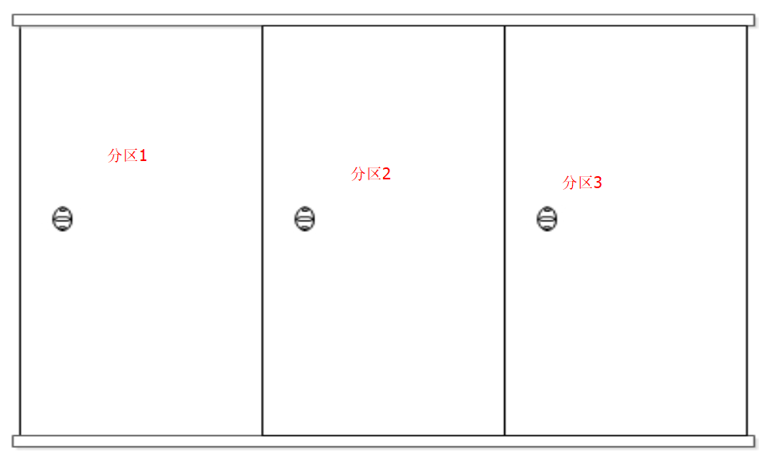
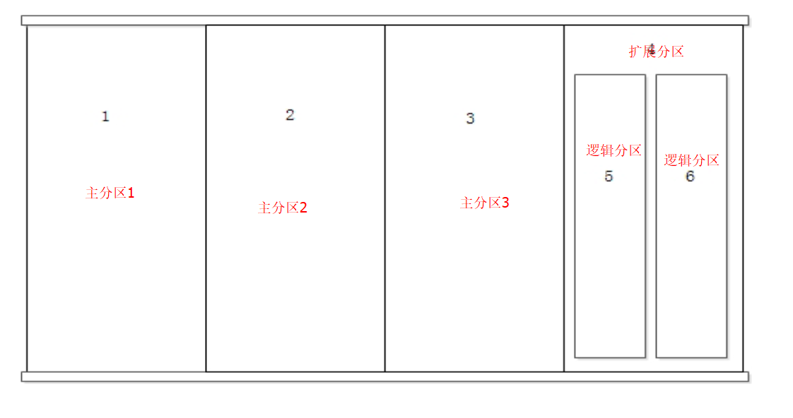
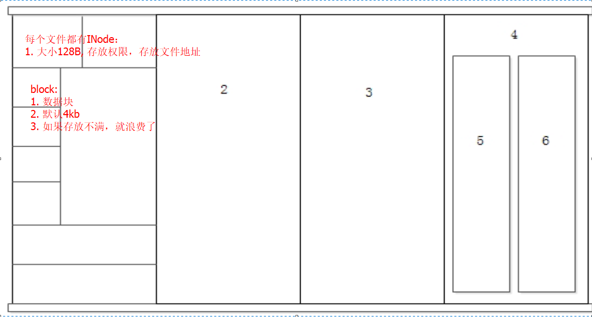

# 三、Linux安装

## 3.1、VMware虚拟机安装与使用
### 3.1.1、介绍
`VMware`是一个虚拟PC的软件，可以在现有的操作系统上虚拟出一个新的硬件环境，相当于模拟出一台新的PC ，以此来实现在一台机器上真正同时运行两个独立的操作系统。

[VMware官方网站](http://www.vmware.com)

### 3.1.2、特点
1. 不需要分区或重新开机就能在同一台PC上使用两种以上的操作系统
2. 本机系统可以与虚拟机系统网络通信
3. 可以设定并且随时修改虚拟机操作系统的硬件环境

### 3.1.3、建议配置
1. CPU：建议主频为1GHz以上
2. 内存：建议1GB以上
3. 硬盘：建议分区空闲空间8GB以上

### 3.1.4、安装

### 3.1.5、新建虚拟机

- 虚拟机网络设置

| 连接方式        | 连接网卡     | 是否能连接本机  | 是否能连接局域网 |  是否能连接公网 |
| :-------------: |:-------------:| :-----:| :-----:| :-----:|
| 桥接      | 本地真实网卡 | 是 |  是 |  是 |
| NAT      | VMNet8      |   是 | 否 | 是 |
| 仅主机 | VMNet1     |    是 | 否 | 否 |

::: tip
1、 建议创建好虚拟机之后，进行快照 
2、如果设置为去桥接模式，将连接方式改为固定的本机网卡
:::

## 3.2、系统分区
### 3.2.1、磁盘分区
1. 概念
    使用分区编辑器（partition editor）在磁盘上划分几个逻辑部分。
    碟片一旦划分成数个分区（Partition），不同类的目录与文件可以存储进不同的分区。
2. 目的
    方便读取数据和存储数据

### 3.2.2、分区表
- MBR分区表（主引导记录分区表）
最大支持2.1TB硬盘，最多支持4个分区（一个硬盘）

- GPT分区表 （全局唯一标示分区表）
GPT支持9.4ZB硬盘（1ZB=1024PB，1PB=1024EB，1EB=1024TB）。理论上支持的分区数没有限制，但windows限制128个主分区

### 3.2.3、分区类型（针对MBR）
- 主分区: 最多只能有4个
- 扩展分区:
    - 一块硬盘最多只能有1个
    - 主分区加扩展分区最多有4个
    - 不能写入数据，只能包括逻辑分区
- 逻辑分区

### 3.2.4、格式化 （逻辑格式化）
1. 概念
    它是指根据用户选定的文件系统（如FAT16、FAT32、NTFS、EXT2、EXT3、EXT4、XFS等），
    在磁盘的特定区域写入特定数据，在分区中划出一片用于存放文件分配表、目录表等用于文件管理的磁盘空间。
2. 目的
    `写入文件系统`，附带将分区清空

::: tip
1、 INode 也是存在存储上线的，不能无限写入空文件

:::

## 3.3、Linux系统安装

## 3.4、远程登录管理工具